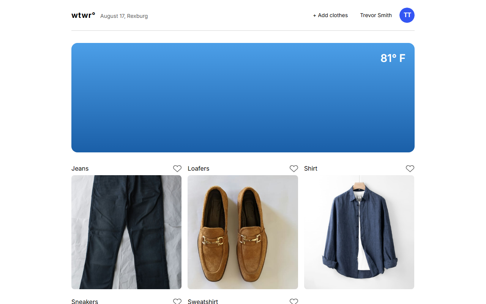
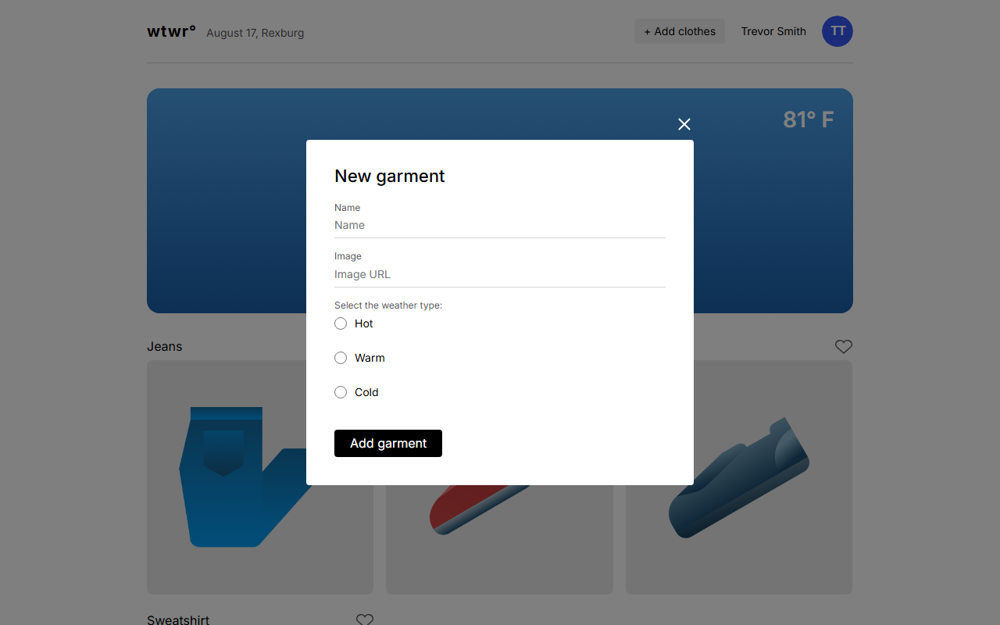

# WTWR (What to Wear?)

WTWR is a weather-aware wardrobe app. It checks the current weather for a set location and recommends clothing items suited to the temperature, then lets the user browse, preview, and add their own garments to the collection.

## Features

- Live weather lookup via the OpenWeatherMap API, converted to a simple hot/warm/cold condition
- A clothing gallery filtered automatically to match the current weather
- A full-size preview modal for each garment
- A form modal for adding new garments (name, image URL, weather type)
- Keyboard (Esc) and overlay-click support for closing modals

## Technologies used

- React (function components, hooks)
- Vite
- JavaScript (ES modules)
- CSS with BEM-style class naming
- normalize.css for cross-browser style resets
- ESLint for linting
- OpenWeatherMap API

## Screenshots

**Main view — weather-filtered clothing gallery**



**Add garment modal**



## Live demo

[View the live demo](https://trevswizle.github.io/se_project_react/)

## Getting started

```bash
npm install
npm run dev
```

The app will be available at the local address Vite prints in the terminal.
